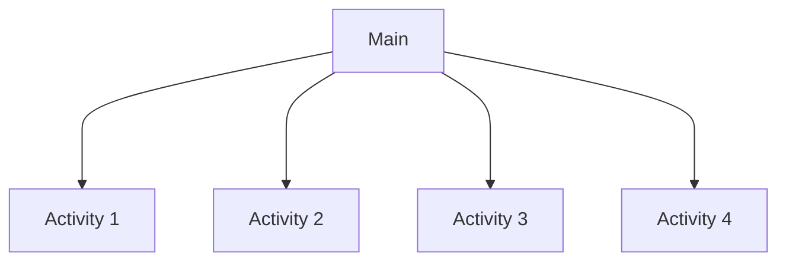

# LP2A4

The `LP2A4` repository was created to be part of the subject `Programming Language II` .

Read this in other languages: [English](./README.md), [Português](./README.pt.md)

The `main` branch structure will follow this schema:

