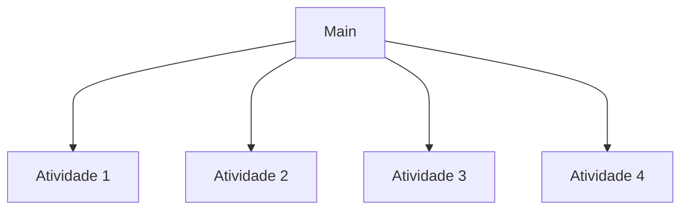

# LP1A3 

O repositório `LP1A3`  foi criado para fazer parte da disciplina de `Linguagem de Programação I` .

Leia em outros idiomas: [English](./README.md), [Português](./README.pt.md)

A estrutura do branch `main` segue este esquema:

 
