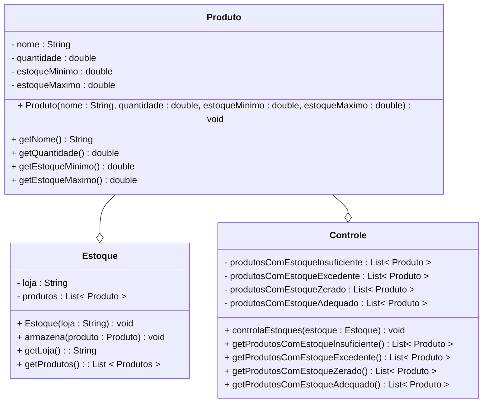

```mermaid
classDiagram
    
    
    class Produto{
        - nome : String
        - quantidade : double
        - estoqueMinimo : double
        - estoqueMaximo : double
        
        
        + Produto(nome : String, quantidade : double, estoqueMinimo : double, estoqueMaximo : double) void
        + getNome() String
        + getQuantidade() double
        + getEstoqueMinimo() double
        + getEstoqueMaximo() double
    }
    
    class Estoque{
        - loja : String
        - produtos : List< Produto >  
        
        + Estoque(loja : String) void
        + armazena(produto : Produto) void
        + getLoja() : String
        + getProdutos() : List < Produtos >
    }
    
    
    
    class Controle{
        - produtosComEstoquelnsuficiente : List< Produto >
        - produtosComEstoqueExcedente : List< Produto >
        - produtosComEstoqueZerado : List< Produto >
        - produtosComEstoqueAdequado : List< Produto >

        + controlaEstoques(estoque : Estoque)  void
        + getProdutosComEstoquelnsuficiente()  List< Produto >
        + getProdutosComEstoqueExcedente()  List< Produto >
        + getProdutosComEstoqueZerado()  List< Produto >
        + getProdutosComEstoqueAdequado()  List< Produto >
    }
    
Produto --o Estoque
Produto --o Controle
```