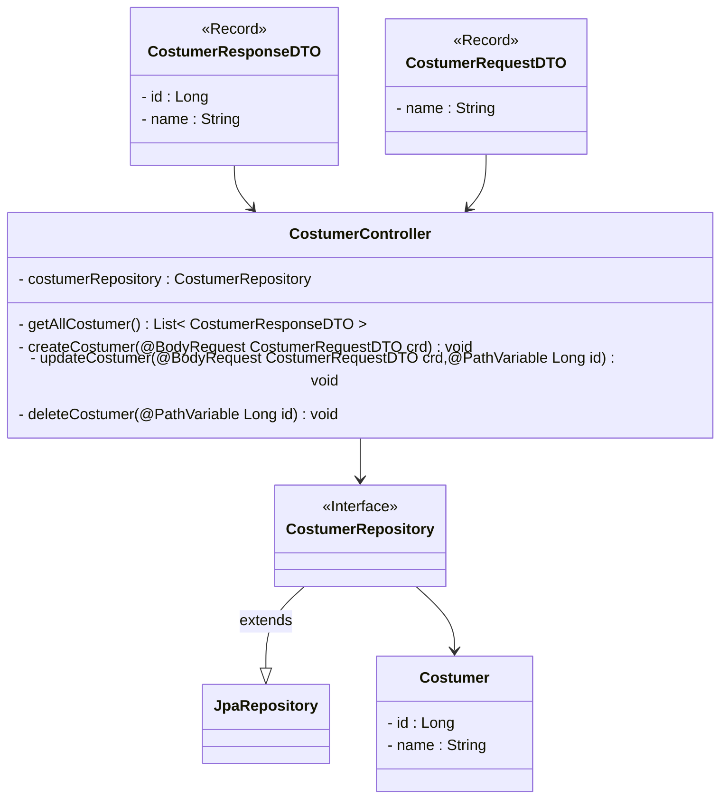

<details>
    <summary>Meal Route</summary>


<h1 align='center'>Meal Route</h1>

<h2 align='center'>List all Meals</h2>

```http
GET
```

```http
/meal
```

Response:

```json
[
    {
        "id": 0,
        "name": "rice and beans",
        "description": "the most tasteful rice and beans you can find in the entire planet !!!",
        "price": 2.0,
        "type": "MAIN"
    }
]
```


---

<h2 align='center'>Delete Meal by Id</h2>

```http
DELETE
```

`/meal/id`

```http
/meal/0
```

Response: 204

```http
NO_CONTENT
```

---

<h2 align='center'>Create Meal</h2>

```http
POST
```

```http
/meal
```

Request:

```json
{
    "name": "rice and beans",
    "description": "the most tasteful rice and beans you can find in the entire planet",
    "price" : 2,
    "type" : 2
}
```

---

<h2 align='center'>Update Meal</h2>

```http
PUT
```

`/meal/id`

```http
/meal/0
```

Request:

```json
{
    "name": "rice and beans",
    "description": "the most tasteful rice and beans you can find in the entire planet !!!",
    "price" : 10,
    "type" : 0
}
```


</details>


<details>
    <summary>Employee Route</summary>


<h1 align='center'>Employee Route</h1>

<h2 align='center'>List All Employees</h2>

```http
GET
```

```http
/employee
```

Response:

```json
[
    {
        "cpf": "123",
        "name": "Jordan"
    }
]
```


---

<h2 align='center'>Delete Employee by Id</h2>

```http
DELETE
```

`/employee/id`

```http
/employee/0
```

Response: 204

```http
NO_CONTENT
```

---

<h2 align='center'>Create Employee</h2>

```http
POST
```

```http
/employee
```

Request:

```json
{
    "cpf"  : "123",
    "name" : "Jordan"
}
```

---

<h2 align='center'>Update Employee</h2>

```http
PUT
```

`/employee/id`

```http
/employee/0
```

Request:

```json
{
    "name" : "Jordan Jackson"
}
```


</details>


<details>
    <summary>Costumer Route</summary>


<h1 align='center'>Costumer Route</h1>

<h2 align='center'>List All Costumers</h2>

```http
GET
```

```http
/costumer
```

Response:

```json
[
    {
        "name": "Gabuh",
        "address": {
            "id": 1,
            "street": "New street 13",
            "city": "New York"
        }
    }
]
```


---

<h2 align='center'>Delete Costumer by Id</h2>

```http
DELETE
```

`/costumer/id`

```http
/costumer/1
```

Response: 204

```http
NO_CONTENT
```

---

<h2 align='center'>Create Costumer</h2>

```http
POST
```

```http
/costumer
```

Request:

```json
{
    "name" : "Gabuh",
    "address" : {
        "street" : "Street 12",
        "city" : "Clouds nf"
    }
}
```

---

<h2 align='center'>Update Costumer</h2>

```http
PUT
```

`/costumer/id`

```http
/costumer/1
```

Request:

```json
{
    "name" : "Gabuh",
    "address" : {
        "id" : 1,
        "street" : "New street 13",
        "city" : "New York"
    }
}
```

</details>